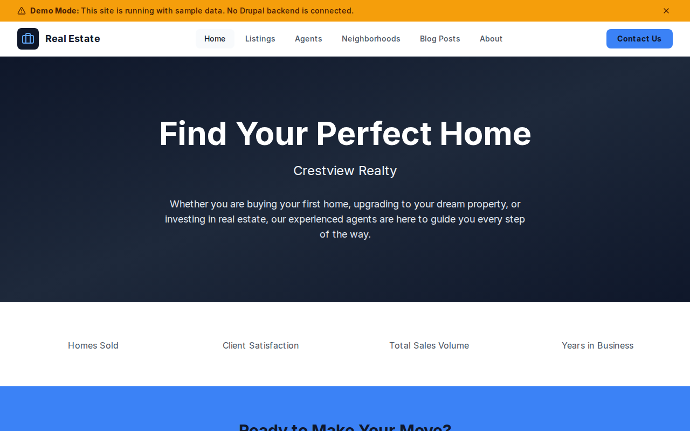

# Decoupled Real Estate

A professional real estate website built with Next.js and Drupal for brokerages, agencies, and independent agents. Showcase property listings, agent profiles, neighborhood guides, and market insights -- all managed through a headless CMS.



[](https://vercel.com/new/clone?repository-url=https://github.com/nextagencyio/decoupled-real-estate&project-name=my-realty)

## Features

- **Property Listings** -- Display homes for sale and rent with price, bedrooms, bathrooms, square footage, address, property type, and featured images
- **Agent Profiles** -- Showcase agents and brokers with headshots, positions, license numbers, contact info, and professional bios
- **Neighborhood Guides** -- Area guides with median home prices, walk scores, lifestyle descriptions, and featured images
- **Blog & Market Insights** -- Publish market updates, buyer/seller guides, and tips categorized by topic
- **Homepage with Stats** -- Configurable landing page with hero, key metrics (homes sold, satisfaction rate, sales volume), and call-to-action

## Quick Start

### 1. Clone the template

```bash
npx degit nextagencyio/decoupled-real-estate my-realty
cd my-realty
npm install
```

### 2. Run interactive setup

```bash
npm run setup
```

This interactive script will:
- Authenticate with Decoupled.io (opens browser)
- Create a new Drupal space
- Wait for provisioning (~90 seconds)
- Configure your `.env.local` file
- Import sample content

### 3. Start development

```bash
npm run dev
```

Visit [http://localhost:3000](http://localhost:3000)

---

## Manual Setup

If you prefer to run each step manually:

<details>
<summary>Click to expand manual setup steps</summary>

### Authenticate with Decoupled.io

```bash
npx decoupled-cli@latest auth login
```

### Create a Drupal space

```bash
npx decoupled-cli@latest spaces create "My Realty"
```

Note the space ID returned (e.g., `Space ID: 1234`). Wait ~90 seconds for provisioning.

### Configure environment

```bash
npx decoupled-cli@latest spaces env 1234 --write .env.local
```

### Import content

```bash
npm run setup-content
```

This imports the following sample content:

- **Homepage** -- "Crestview Realty" with hero, 4 stat counters (1,200+ homes sold, 98% satisfaction, $850M volume, 15 years), and CTA
- **Listing: Charming Craftsman Bungalow** -- 3 bed / 2 bath, $485,000, Oak Park
- **Listing: Modern Lakefront Condominium** -- 2 bed / 2 bath, $375,000, Lakeside
- **Listing: Stately Colonial Estate** -- 5 bed / 4 bath, $1,250,000, Willow Creek
- **Listing: Industrial-Chic Downtown Loft** -- 1 bed / 1 bath, $2,400/month rental
- **Agent: Rachel Morgan** -- Broker/Owner, 15+ years, luxury residential
- **Agent: Tom Delgado** -- Senior Agent, first-time buyers, bilingual
- **Agent: Priya Sharma** -- Urban Properties specialist, urban planning background
- **Neighborhood: Downtown** -- Walk score 92, median $340K, urban lifestyle
- **Neighborhood: Oak Park** -- Walk score 78, median $475K, family-friendly
- **Neighborhood: Lakeside** -- Walk score 85, median $625K, waterfront luxury
- **Blog: Spring 2026 Housing Market Outlook** -- Market conditions and advice
- **Blog: First-Time Homebuyer Guide** -- Step-by-step buying process
- **Blog: 10 Home Staging Tips** -- Proven seller strategies
- **About Crestview Realty** -- Company history and approach
- **Contact** -- Office location, hours, and contact details

</details>

## Content Types

### Listing
Property listings for sale or rent.

| Field | Type | Description |
|-------|------|-------------|
| Body | text | Full property description and features |
| Price | string | Listing price (e.g., "$485,000" or "$2,400/month") |
| Bedrooms | integer | Number of bedrooms |
| Bathrooms | integer | Number of bathrooms |
| Square Feet | string | Total square footage |
| Address | string | Property street address |
| Property Type | string | Single Family, Condominium, Loft, etc. |
| Listing Type | string | For Sale or For Rent |
| Featured Image | image | Main property photo |

### Agent
Real estate agents and brokers.

| Field | Type | Description |
|-------|------|-------------|
| Body | text | Professional bio and specialties |
| Position | string | Job title (Broker/Owner, Senior Agent, etc.) |
| Email | string | Professional email |
| Phone | string | Contact phone number |
| License Number | string | Real estate license ID |
| Photo | image | Professional headshot |

### Neighborhood
Area guides with market data.

| Field | Type | Description |
|-------|------|-------------|
| Body | text | Area description, living details, and target audience |
| Median Price | string | Median home price in the area |
| Walk Score | integer | Walkability score (0-100) |
| Featured Image | image | Neighborhood photo |

### Blog Post
Market insights and guides.

| Field | Type | Description |
|-------|------|-------------|
| Body | text | Full article content |
| Post Category | string | Category (Market Update, Buyer Guide, Seller Tips) |
| Featured Image | image | Article hero image |

## Customization

### Colors & Branding
Edit `tailwind.config.js` to customize colors, fonts, and spacing. The default theme uses slate and blue tones for a professional real estate look.

### Content Structure
Modify `data/real-estate-content.json` to change content types, fields, or sample data before importing.

### Components
React components are in `app/components/`. Key files:
- `HomepageRenderer.tsx` -- Landing page with hero, stats, and CTA
- `ListingCard.tsx` -- Property listing card with price and specs
- `AgentCard.tsx` -- Agent profile card with photo and contact info
- `NeighborhoodCard.tsx` -- Neighborhood guide card with walk score
- `BlogPostCard.tsx` -- Blog article card
- `Header.tsx` -- Navigation and site branding

## Demo Mode

Demo mode lets you preview the real estate site without connecting to a Drupal backend.

### Enable Demo Mode

```bash
NEXT_PUBLIC_DEMO_MODE=true
```

Or add to `.env.local`:
```
NEXT_PUBLIC_DEMO_MODE=true
```

### Removing Demo Mode

To switch to production with real CMS data:

1. Delete `lib/demo-mode.ts`
2. Delete `data/mock/` directory
3. Delete `app/components/DemoModeBanner.tsx`
4. Remove `DemoModeBanner` from `app/layout.tsx`
5. Remove demo mode checks from `app/api/graphql/route.ts`

## Deployment

### Vercel (Recommended)
[](https://vercel.com/new/clone?repository-url=https://github.com/nextagencyio/decoupled-real-estate)

Set `NEXT_PUBLIC_DEMO_MODE=true` in Vercel environment variables for a demo deployment.

### Other Platforms
Works with any Node.js hosting platform that supports Next.js.

## Documentation

- [Decoupled.io Docs](https://www.decoupled.io/docs)
- [Next.js Documentation](https://nextjs.org/docs)
- [Drupal GraphQL](https://www.decoupled.io/docs/graphql)

## License

MIT
